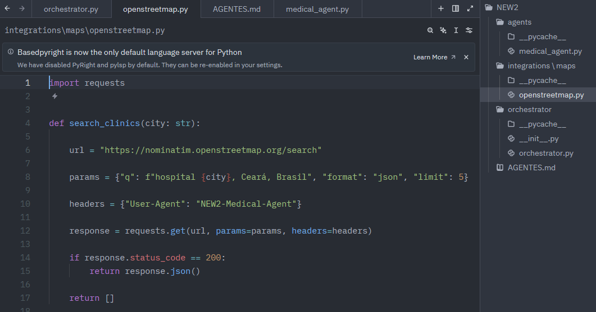

# Agente-Inteligente-para-Controle-Medico

# Agente Inteligente para Controle Médico

## Sobre o Projeto

Projeto desenvolvido durante a **Imersão IA da Alura**, com o objetivo de aplicar conceitos de Inteligência Artificial e automação na criação de um sistema para registro e gerenciamento de informações médicas.

O agente auxilia no controle de consultas, exames e atendimentos, organizando informações de forma estruturada para facilitar o acompanhamento e futuras consultas.

---

## Funcionalidades

✅ Registro de consultas médicas e exames

✅ Cadastro de especialidades e informações médicas

✅ Registro de observações e resultados de exames

✅ Busca de clínicas e hospitais por meio da API OpenStreetMap

✅ Organização e consulta de dados médicos

---

## 📸 Evidências do Projeto

### Certificado

### Agent Medical

### Openstreetmap

### Teste realizado com sucesso

### Resultado do teste

---

## Resultado

O projeto demonstrou na prática como agentes inteligentes podem automatizar processos administrativos, organizar informações e apoiar a tomada de decisões através da integração entre IA, APIs e automação.

---

## Autor

**Viviane Vieira**

LinkedIn: www.linkedin.com/in/viviane-vieira-de-souza

